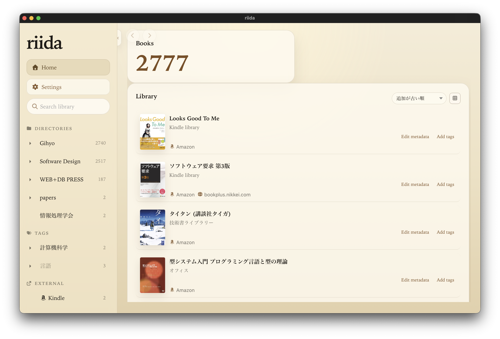

# riida

`riida` is a Tauri + Rust desktop app for managing and reading local PDF libraries.

It was created to meet the needs of an author who owns more than 1,000 ebooks and wants to reach the right book quickly through a single bookshelf app with a built-in PDF reader.

The name "Riida" comes from "Reader", reflecting that primary goal.



## Install

Download an installer for your platform from:

- [riida releases](https://github.com/zonuexe/riida/releases)

On macOS, if Gatekeeper refuses to open the downloaded app, move it to `/Applications` and run:

```bash
xattr -cr /Applications/riida.app
```

It is currently focused on:

- indexing PDFs from a watched local folder
- browsing the library by directory and search
- reading with either native PDF rendering or PDF.js
- keeping per-file notes and viewer preferences locally

## Current Status

This project is still in active development.

The current working setup assumes a local PDF collection such as:

```toml
library_roots = ["~/Documents/Ebooks/"]
```

## Configuration

Configuration is loaded from `riida.toml`.

The app prefers:

- `~/.config/riida/riida.toml` when `~/.config` exists
- otherwise the OS-native config directory

Example:

```toml
library_roots = ["~/Documents/Ebooks/"]
excluded_patterns = ["**/backup/**", "*.bak.pdf"]
pdf_renderer = "pdfjs"
```

For development, copy [`riida.toml.example`](riida.toml.example) to `riida.toml` and edit it locally.

## Amazon.co.jp metadata bookmarklet

On a Kindle Store / ebook product page on **Amazon.co.jp**, you can use this bookmarklet to scrape visible product details and copy a JSON object to the clipboard. The shape matches what `riida` expects when you paste into the book metadata editor’s JSON import (title, authors, description, publisher, release date, language, ASIN, cover URL).

**Install:** create a new bookmark and paste the entire string below into the bookmark’s URL / location field (it must start with `javascript:`). Then open an Amazon.co.jp product page and activate the bookmark.

**Notes:** Amazon may change their HTML at any time, which can break extraction. Bookmarklets run in the page context—only install code you trust. Clipboard copy requires a secure context (`https://`) and may prompt for permission in some browsers.

```text
javascript:(async()=>{const norm=s=>(s||'').replace(/[\u200e\u200f\xa0]/g,' ').replace(/\s+/g,' ').trim();const uniq=arr=>[...new Set(arr.filter(Boolean))];const pick=selectors=>{for(const selector of selectors){const el=document.querySelector(selector);if(!el)continue;const text=norm(el.textContent);if(text)return text;}return'';};const fallbackTitle=()=>{let t=document.querySelector('meta[name="title"]')?.content||document.title||'';t=norm(t).replace(/^Amazon\.co\.jp:\s*/,'').replace(/\s+eBook\s*:\s.*$/,'').replace(/\s*:\s*Kindleストア\s*$/,'');if(t.includes(' | '))t=t.split(' | ')[0];return norm(t);};const cleanLabel=s=>norm(s).replace(/\s*[:：]\s*$/,'').trim();const parseDate=s=>{s=norm(s);let m=s.match(/(\d{4})[\/-](\d{1,2})[\/-](\d{1,2})/)||s.match(/(\d{4})年\s*(\d{1,2})月\s*(\d{1,2})日/);if(!m)return'';const[,y,mo,d]=m;return`${y}-${String(mo).padStart(2,'0')}-${String(d).padStart(2,'0')}`;};const parseLanguage=s=>{s=norm(s);const map={'日本語':'ja','英語':'en','フランス語':'fr','ドイツ語':'de','スペイン語':'es','イタリア語':'it','ポルトガル語':'pt','ロシア語':'ru','韓国語':'ko','中国語':'zh','中国語(簡体字)':'zh-Hans','中国語（簡体字）':'zh-Hans','中国語(繁体字)':'zh-Hant','中国語（繁体字）':'zh-Hant'};if(map[s])return map[s];const m=s.match(/^([a-z]{2})(?:[-_][A-Za-z]{2,4})?$/i);return m?m[1].toLowerCase():'';};const addDetail=(details,label,value)=>{label=cleanLabel(label);value=norm(value);if(label&&value&&!(label in details))details[label]=value;};const extractDetails=()=>{const details={};document.querySelectorAll('#detailBulletsWrapper_feature_div li,#detailBullets_feature_div li').forEach(li=>{const labelEl=li.querySelector('.a-text-bold');if(!labelEl)return;const label=cleanLabel(labelEl.textContent);let value='';const listItem=li.querySelector('.a-list-item')||li;for(const child of Array.from(listItem.children)){if(child===labelEl)continue;const text=norm(child.textContent);if(text){value=text;break;}}if(!value){value=norm(li.textContent.replace(labelEl.textContent,'')).replace(/^[:：]\s*/,'');}addDetail(details,label,value);});document.querySelectorAll('#productDetails_detailBullets_sections1 tr,#productDetails_techSpec_section_1 tr').forEach(tr=>{addDetail(details,tr.querySelector('th')?.textContent,tr.querySelector('td')?.textContent);});document.querySelectorAll('.rpi-attribute-content').forEach(card=>{addDetail(details,card.querySelector('.rpi-attribute-label,[class*="attribute-label"]')?.textContent,card.querySelector('.rpi-attribute-value,[class*="attribute-value"]')?.textContent);});return details;};const extractAuthors=()=>uniq(Array.from(document.querySelectorAll('#bylineInfo .author,#bylineInfo_feature_div .author')).map(el=>{const a=el.querySelector('a');const raw=a?a.textContent:(el.childNodes[0]?.textContent||el.textContent||'');return norm(raw).replace(/\s*\([^)]*\)\s*,?$/,'').trim();}));const extractDescription=()=>{const root=document.querySelector('#bookDescription_feature_div .a-expander-content')||document.querySelector('#bookDescription_feature_div')||document.querySelector('#productDescription');if(!root)return'';const clone=root.cloneNode(true);clone.querySelectorAll('script,style,noscript').forEach(n=>n.remove());return norm(clone.textContent.replace(/続きを読む|もっと少なく読む/g,''));};const extractCover=()=>{const img=document.getElementById('landingImage')||document.getElementById('imgBlkFront')||document.getElementById('ebooksImgBlkFront');if(!img)return'';let url=img.getAttribute('data-old-hires');if(!url){const dyn=img.getAttribute('data-a-dynamic-image');if(dyn){try{const urls=Object.keys(JSON.parse(dyn));url=urls[urls.length-1];}catch(e){}}}return url||img.src||'';};const details=extractDetails();const data={};const title=pick(['#productTitle','#ebooksProductTitle','h1#title span','#title span'])||fallbackTitle();const authors=extractAuthors();const description=extractDescription();const publisher=details['出版社']||'';const releaseDate=parseDate(details['発売日']||'')||parseDate(pick(['#productSubtitle']));const language=parseLanguage(details['言語']||'');const asin=norm(document.querySelector('#ASIN')?.value||details['ASIN']||details['ISBN-10']||'');const coverUrl=extractCover();if(title)data.title=title;if(authors.length)data.authors=authors;if(description)data.description=description;if(publisher)data.publisher=publisher;if(releaseDate)data.releaseDate=releaseDate;if(language)data.language=language;if(asin)data.asin=asin;if(coverUrl)data.coverUrl=coverUrl;const json=JSON.stringify(data,null,2);const copy=async text=>{if(navigator.clipboard&&window.isSecureContext){try{await navigator.clipboard.writeText(text);return true;}catch(_){}}const ta=document.createElement('textarea');ta.value=text;ta.setAttribute('readonly','');ta.style.position='fixed';ta.style.top='0';ta.style.left='0';ta.style.opacity='0';document.body.appendChild(ta);ta.focus();ta.select();ta.setSelectionRange(0,ta.value.length);let ok=false;try{ok=document.execCommand('copy');}catch(_){}ta.remove();return ok;};const copied=await copy(json);if(copied){alert('JSONをクリップボードにコピーしました。\n\n'+json);}else{prompt('コピーに失敗したため、ここから手動でコピーしてください。',json);}})().catch(err=>{console.error(err);alert('抽出に失敗しました: '+(err&&err.message?err.message:err));});
```

## Local Storage

The app separates storage by role:

- config: config directory
- data: app data directory, including SQLite
- cache: cache directory, including thumbnails

Legacy project-root files are migrated forward automatically on startup when possible.

## License and Copyright

This project is licensed under the [Mozilla Public License 2.0](https://www.mozilla.org/en-US/MPL/2.0/). See [`LICENSE`](LICENSE).

Licenses and notice texts for bundled Rust and JavaScript dependencies are collected in [`THIRD-PARTY-LICENSES-rust.md`](THIRD-PARTY-LICENSES-rust.md) and [`THIRD-PARTY-LICENSES-js.md`](THIRD-PARTY-LICENSES-js.md).

Vendored third-party assets are kept with their own license text in the repository when needed. For example, the bundled Font Awesome files include [their license text](src/vendor/fontawesome/LICENSE.txt).

> This Source Code Form is subject to the terms of the Mozilla Public License, v. 2.0. If a copy of the MPL was not distributed with this file, You can obtain one at <https://mozilla.org/MPL/2.0/>.

Copyright belongs to the contributors to this repository unless otherwise noted.

## macOS Distribution Note

This project does not use Apple's paid code signing and notarization workflow.

If you download a macOS build artifact, Gatekeeper may report that the app is damaged or unsafe to open.

Example:

```bash
cp -R riida.app /Applications/
xattr -cr /Applications/riida.app
open /Applications/riida.app
```

This is intended only for local, personal use on your own machine.

## Development

The project includes a Nix flake-based development shell.

```bash
nix --extra-experimental-features 'nix-command flakes' develop
npm install
npm run tauri dev
```

Basic verification:

```bash
npm run build
cargo check --manifest-path src-tauri/Cargo.toml
```

## Contributing

- Minimum contributor workflow: [CONTRIBUTING.md](CONTRIBUTING.md)
- Architecture and system design notes: [DESIGN.md](DESIGN.md)
- Development details and implementation notes: [AGENTS.md](AGENTS.md)
